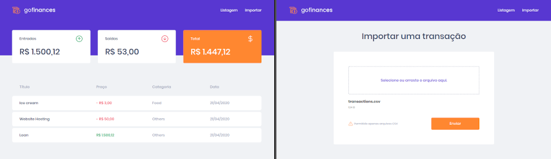

# GoFinances

Este é um desafio do GoStack Bootcamp da RocketSeat. [Link para o desafio](https://github.com/Rocketseat/bootcamp-gostack-desafios/tree/master/desafio-fundamentos-reactjs)

Nesse desafio, foi desenvolvido a aplicação de gestão de transações, a GoFinances. Praticando o que foi aprendido até agora no React.js junto com TypeScript, utilizando rotas e envio de arquivos por formulário.

Essa é uma aplicação que se conecta ao backend do [Desafio 06](https://github.com/frfontoura/gostack-desafio06-typeorm-multer), para exibir as transações criadas e permitir a importação de um arquivo CSV para gerar novos registros no banco de dados.



# Requisitos

* NodeJs - (desenvolvido utilizando a versão v12.16.2)
* Yarn - (opcional - versão 1.22.4)

# Tecnologias utilizadas

* ReactJs
* Typescript
* StyledComponents

# Instalação

1 - Fazer o gitclone:

```
git clone https://github.com/frfontoura/gostack-go-finances-web
```

2 - Instalar as dependências:
```
yarn
```

3 - Inicializar o servidor:
```
yarn start
```

# Executando os testes

Para executar os testes, utilizar o comando:
```
yarn test
```
